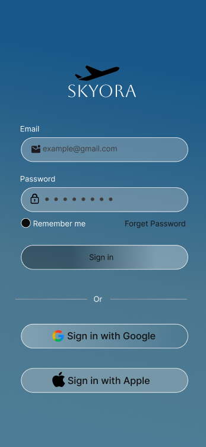
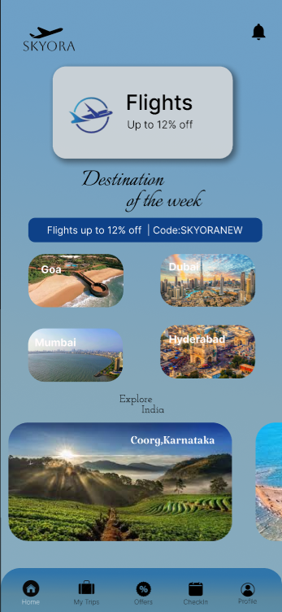
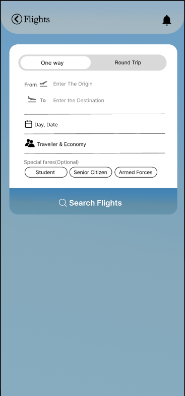
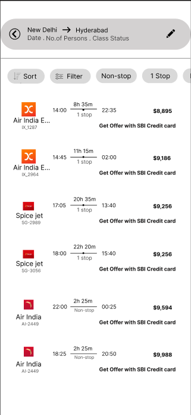
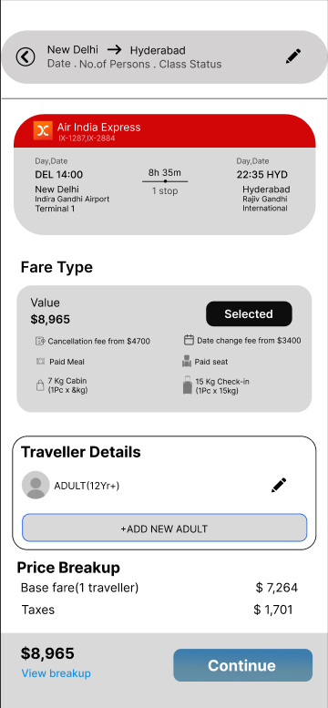
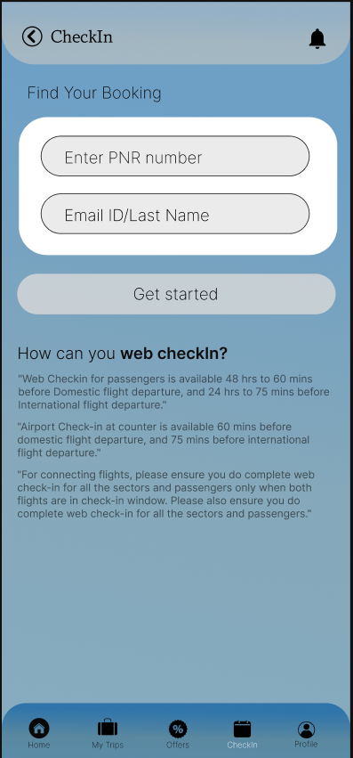
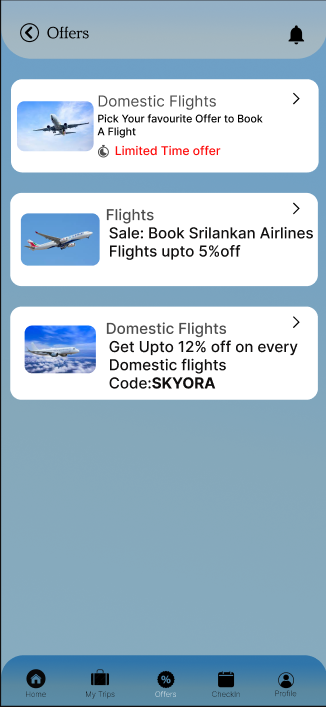
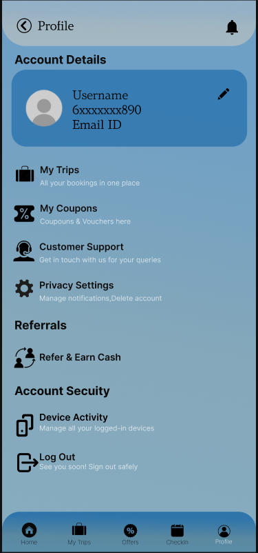

# Skyora – Travel & Flight Booking UI/UX Design

## 📌 Overview

Skyora is a UI/UX design project focused on creating a simple and user-friendly travel and flight booking experience.

The design covers the complete journey from login and flight search to booking, check-in, offers, and profile management.

## 🎯 Objective

The goal of Skyora is to make the flight booking process simple, intuitive, and visually engaging for users.

## ✨ Key Screens

- Splash Screen
- Login
- Home
- Flight Search
- Flight Details
- Booking
- Check-in
- My Trips
- Offers
- Profile

## 🛠️ Tools Used

- Figma
- UI/UX Design
- Wireframing
- Prototyping
- User Flow Design

## 🎨 User Flow

Login → Home → Flight Search → Flight Details → Booking → Check-in → My Trips

## 📱 Screenshots

### Splash Screen

### Login

### Home

### Flight Search

### Flight Details

### Booking

### Check-in

### My Trips

### Offers

### Profile

## 🔗 Figma Prototype

**Interactive Prototype:**  
https://www.figma.com/proto/gnp2rpGb1ulnFudouMXQDJ/Untitled?node-id=15-6&starting-point-node-id=15%3A6

## 📚 Project Type

This is a UI/UX design prototype created in Figma. It is not a fully developed application.
